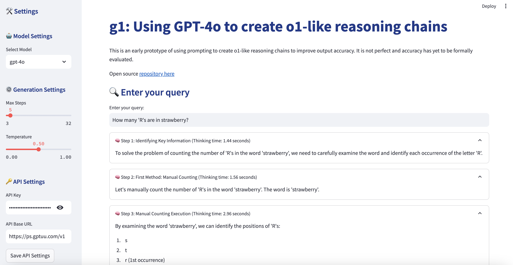
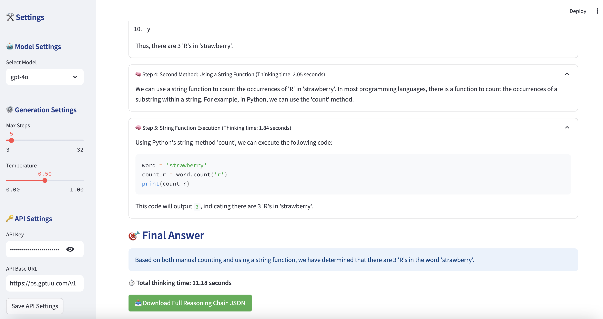

# g1: Enhanced Reasoning Chains with GPT-4o




## Overview

This repository is an enhanced version of the original [g1 project](https://github.com/bklieger-groq/g1), which uses GPT-4o to create o1-like reasoning chains. The enhancements include additional features, improved UI, and better customization options. One significant improvement is the transition from Groq to an OpenAI-compatible API, implemented using `litellm`.

## New Features

- **OpenAI API**: The system now uses the OpenAI API for enhanced performance and reliability.
- **API Configuration**: Added input fields for API key and base URL in the sidebar, along with a "Save API Settings" button to update environment variables.
- **Enhanced UI**: Improved styling and layout for a better user experience.
- **Downloadable Reasoning Chains**: Users can download the full reasoning chain in JSON format.

## Quickstart

To get started with the Streamlit UI, follow these steps:

1. Create a virtual environment:

   ```bash
   python3 -m venv venv
   source venv/bin/activate
   ```

2. Install the required dependencies:

   ```bash
   pip3 install -r requirements.txt
   ```

3. Set your OpenAI API key:

   ```bash
   export OPENAI_API_KEY=sk-...
   ```

4. Run the Streamlit app:

   ```bash
   streamlit run app.py
   ```

## Usage

1. **Model Settings**: Select the desired model from the sidebar.
2. **Generation Settings**: Adjust the maximum number of reasoning steps and the temperature parameter for generation.
3. **API Settings**: Enter your API key and base URL, then save the settings to update the environment variables.
4. **Query Input**: Use the input field to enter your query.
5. **Response Generation**: The system will generate a step-by-step reasoning chain, displaying each step, the final answer, and the thinking time for each reasoning step.

## Downloading Results

Once the reasoning process is complete, you can download the full reasoning chain in JSON format using the provided download link.

## Configuration

Environment variables are used for API configuration:

- `OPENAI_API_KEY`: Your OpenAI API key.
- `OPENAI_API_BASE`: The base URL for the API (optional).

These can be set manually or through the UI using the provided fields in the sidebar.
